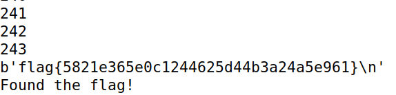

# CTF Semana 10 - Weak Encryption


## Identificação do problema

Primeiramente, conseguimos ver que há um problema na linha que define a variável `offset`.
Existe uma variável global `KEY_LEN` com valor 16, o que significa que a key gerada terá 16 bytes, mas pela função **gen()** conseguimos notar que os primeiros 13 bytes da key serão sempre 0 : 

```py
def gen(): 
	offset = 3 # Hotfix to make Crypto blazing fast!!
	key = bytearray(b'\x00'*(KEYLEN-offset)) 
	key.extend(os.urandom(offset))
	return bytes(key)
```

Assim, só os últimos 3 bytes da key serão variáveis, o que torna esta criptação vulnerável a ataques brute-force.

## Montando um ataque

Para desenvolver um ataque brute-force precisamos de obter o `ciphertext` e o `nonce`, que nos são dados através do comando `nc ctf-fsi.fe.up.pt 6003`

```py
nonce = binascii.unhexlify("158d7f0badc79883e78258ae58bc5823")
ciphertext = binascii.unhexlify("2812c2e36fe5f662ddfd42d67a7657d5090a3773d5e0daf60952e737e39fb33d260bdf00d7510c")

for i in range(256):
	print(i)
	for j in range(256):
		for k in range(256):
			key = b'\x00'*13 + bytes([i,j,k])
			plain = binascii.hexlify(dec(key,ciphertext,nonce))
			if plain.startswith(b'666c61677b'): # 'flag{' em hexadecimal
                		print(binascii.unhexlify(plain))
                		print("Found the flag!")
                		exit()
```

Após rodar o comando `python3 cipherspec.py` e esperar alguns minutos conseguimos obter a flag

