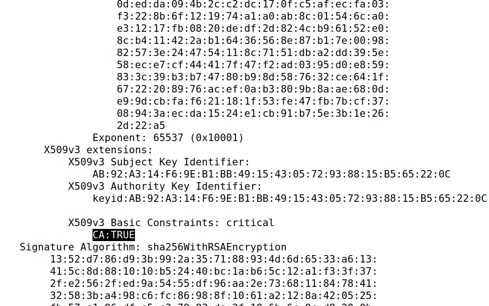
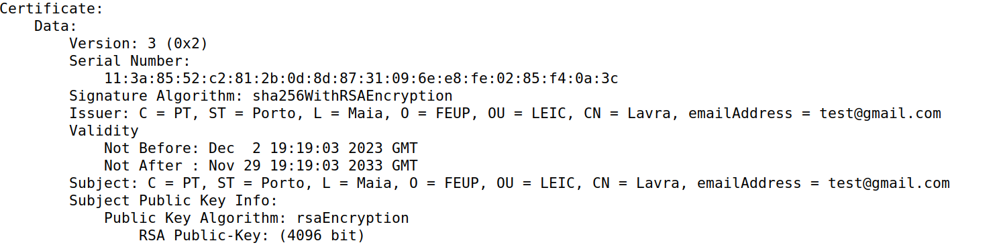
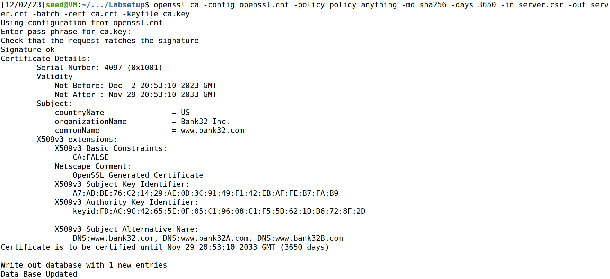
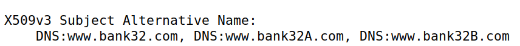
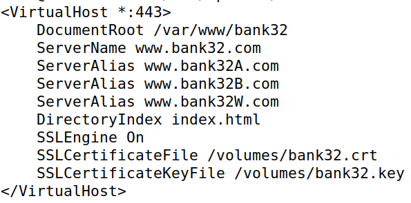
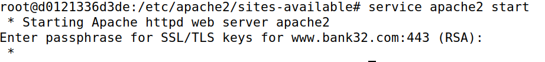

# Semana 11 - Public Key Infrastructure

## Setup

Antes de tudo, temos que dar setup do DNS. Para isso, temos que alterar o ficheiro `/etc/hosts`:

```shell
sudo nano /etc/hosts    #Temos que adicionar 10.9.0.80  www.bank32.com
```

## Task 1 - Becoming a Certificate Authority (CA)

Primeiramente, temos de copiar o ficheiro `usr/lib/ssl/openssl.cnf` para o diretório atual:

```shell
cp usr/lib/ssl/openssl.cnf .
```

Depois de descomentar a linha do `unique_subject`, temos de seguir a configuração definida na seção `CA_default` e criar múltiplos sub-diretórios:

```shell
mkdir CA
cd CA
mkdir certs crl
touch index.txt
mkdir newcerts
cat >> serial
1000
```

Agora temos de generar um certificado auto-assinado para a CA:

```shell
openssl req -x509 -newkey rsa:4096 -sha256 -days 3650 -keyout ca.key -out ca.crt
```

Depois de correr este comando, fomos prompted para inserir vários espaços de informação. Inserimos o seguinte:

    - Pass Phrase: 1234
    - Country Name: PT
    - State or Province Name: Porto
    - Locality Name: Maia
    - Organization Name: FEUP
    - Organization Unit Name: LEIC
    - Common Name: Lavra
    - Email Address: test@gmail.com


Podemos, agora, correr os seguintes comandos para ver o conteúdo desencriptado do certificado e da chave:

```shell
openssl x509 -in ca.crt -text -noout
openssl rsa -in ca.key -text -noout
```

### Questões

1. Que parte do certificado indica que é um certificado CA?



Aqui conseguimos observar que `CA` está set a `TRUE`, o que quer dizer que este é um certificado **CA**

2. Que parte do certificado indica que é um certificado **auto-assinado**?



Aqui conseguimos ver que tanto o `ISSUER` quanto o `SUBJECT` têm a mesma informação, o que significa que o certificado é **auto-assinado**

3. No algoritmo RSA, temos um expoente público ***e***, um expoente privado ***d***, um módulo ***n*** e dois números secretos ***p*** e ***q***, tal que ***n*** = ***p\*q***. Identifica os valores destes elementos no certificado e na chave.

No ficheiro conseguimos observar os seguintes parâmetros:

    - modulus, que representa o módulo n
    - publicExponent, que representa o expoente público
    - privateExponent, que representa o expoente privado
    - prime1, que representa o número secreto p
    - prime2, que representa o número secreto q

## Task 2 - Generating a Certificate Request for your Web Server

Nesta task, temos que generar um **Certificate Signing Request (CSR)** para o site `www.bank32.com` que adicionamos no [setup](#setup) :

```shell
openssl req -newkey rsa:2048 -sha256 -keyout server.key -out server.csr -subj "/CN=www.bank32.com/O=Bank32 Inc./C=US" -passout pass:1234 -addext "subjectAltName = DNS:www.bank32.com, DNS:www.bank32A.com, DNS:www.bank32B.com"
```

## Task 3 - Generating a Certificate for your server

Primeiro, temos que descomentar a linha `copy_entensions = copy` do ficheiro `openssl.cnf`.

Depois disso, temos que assinar o certificado para o servidor do `www.bank32.com`:

```shell
openssl ca -config openssl.cnf -policy policy_anything -md sha256 -days 3650 -in server.csr -out server.crt -batch -cert ca.crt -keyfile ca.key
```




Depois de assinar o certificado, podemos descodificar o conteúdo do certificado e ver se os nomes alternativos estão incluídos:

```shell
openssl x509 -in server.crt -text -noout
```



Como podemos observar, os nomes alternativos estão incluídos.

## Task 4 - Deploying Certificate in an Apache-Based HTTPS Website

Primeiramente, é necessário copiar os ficheiros `server.crt` e `server.key` para a pasta `volumes` e mudar o nome dos ficheiros para `bank32`, com a respetiva extensão.

Depois disso, precisamos de abrir uma shell no container e alterar o ficheiro `/etc/apache2/sites-available/bank32_apache_ssl.conf` :



Agora, temos de começar o server. Para isso, corremos o seguinte comando na shell do container:

```shell
service apache2 start
```



Agora, podemos aceder ao servidor através do url `www.bank32.com`: 