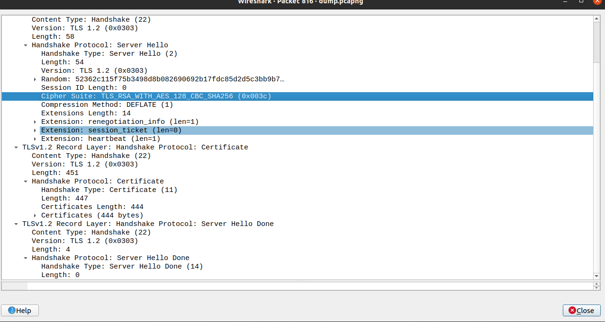

# CTF Semana 12 - Find my TLS

## Identificação dos parâmetros

A flag tem o seguinte formato:

**flag{<frame_start>-<frame_end>-<selected_cipher_suite>-<total_encrypted_appdata_exchanged>-<size_of_encrypted_message>}**, onde:

- **<frame_start>** e **<frame_end>** são o primeiro e último (respetivamente) números de frame correspondentes ao procedimento de handshake do TLS.
- **<selected_cipher_suite>** é a ciphersuite escolhida para a conexão TLS (o nome, não o código)
- **<total_encrypted_appdata_exchanged>** é a soma total do tamanho dos dados cifrados trocados neste canal, até à sua terminação.
- **<size_of_encrypted_message>** é o tamanho da mensagem cifrada no handshake que concluí o procedimento de handshake.

### Frame Start e Frame End

Para descobrirmos `Frame Start`, temos de encontrar o pacote `Client Hello` com número aleatório **52362c11ff0ea3a000e1b48dc2d99e04c6d06ea1a061d5b8ddbf87b001745a27**.

Para fazer isso, podemos escrever o seguinte na barra de filtros do **Wireshark**:

`tls.handshake.random == 52:36:2c:11:ff:0e:a3:a0:00:e1:b4:8d:c2:d9:9e:04:c6:d0:6e:a1:a0:61:d5:b8:dd:bf:87:b0:01:74:5a:27`

Como podemos ver, este pacote é o pacote número **814**.

Se tirarmos o filtro e procurarmos o pacote número **814**, vemos o seguinte:

O último pacote deste **handshake** em específico é o pacote número **819**.

Portanto, `Frame Start` é **814** e `Frame End` é **819**.

### Selected Cipher Suite

Clicando no pacote `Server Hello`, se formos ao parâmetro `Handshake Protocol: Server Hello` conseguimos ver que há um campo chamado `ciphersuite`:

Portanto, `selected_cipher_suite` é **TLS_RSA_WITH_AES_128_CBC_SHA256**.

### Total Encrypted AppData Exchanged

Para calcular a `Total Encrypted AppData Exchanged` temos que ver o tamanho da mensagem encriptada de cada pacote de **Application Data** desde o handshake específico e somar.
Para isso, temos só que situar esse **handshake**, que começa no pacote número 814 e somar as lengths dos próximos pacotes de **Application Data**.

Portanto, `total_encrypted_appdata_exchanged` é **1264** bytes.

**Nota**: 151+1255 não é o tamanho total dos dados encriptados, é o tamanho total dos pacotes de **ApplicationData**. A **length** de cada mensagem encriptada está dentro de cada pacote no parâmetro **length**.

### Size of Encrypted Message

Temos de voltar a detetar os pacotes de **handshake**, pois o tamanho da mensagem encriptada no **handshake** está no último pacote que o conclui.

Após encontrar esse pacote, que é o último pacote diretamente antes do primeiro pacote de **Application Data**, podemos ver o campo **length** da **Encrypted Handshake Message**.

Como podemos ver, `size_of_encrypted_message` é **80**.

## Construção da flag

Com isso, ficamos com os seguintes valores:

- frame_start = 814
- frame_end =  819
- selected_cipher_suite = TLS_RSA_WITH_AES_128_CBC_SHA256
- total_encrypted_appdata_exchanged = 1406
- size_of_encrypted_message = 80

Sendo assim, a flag é **flag{814-819-TLS_RSA_WITH_AES_128_CBC_SHA256-1264-80}**