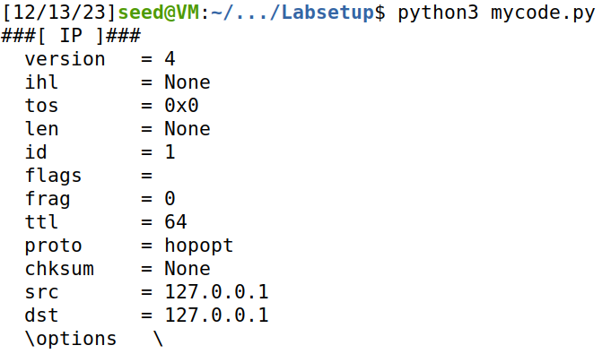
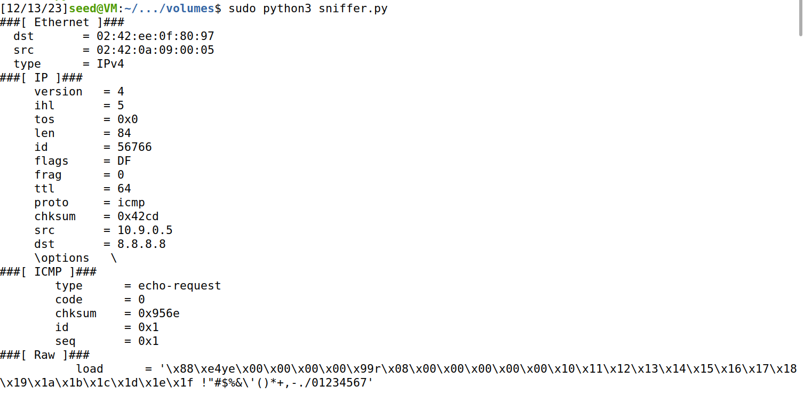
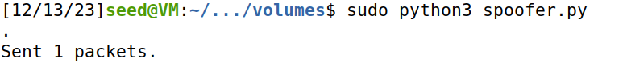
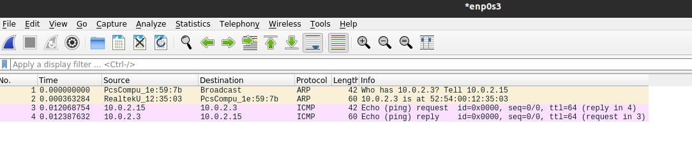
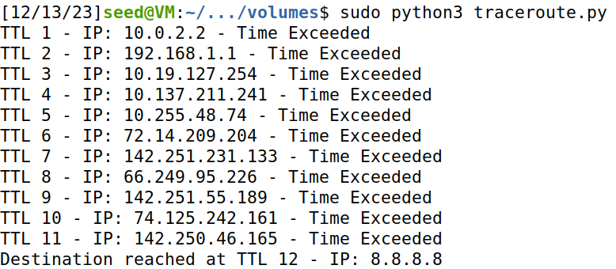

# Semana 12 - Sniffing and Spoofing

## Setup 

Precisamos de saber o nome da `network interface` do container na nossa VM. Para isso, fazemos `ifconfig` no terminal e procuramos pelo IP **10.9.0.1**:

```sh
ifconfig
br-35f18959ffa2: flags=4163<UP,BROADCAST,RUNNING,MULTICAST>  mtu 1500
        inet 10.9.0.1  netmask 255.255.255.0  broadcast 10.9.0.255
```

## Task 1 - Using Scapy to Sniff and Spoof Packets

Primeiro, temos de criar um ficheiro python:

```sh
touch mycode.py
```

Depois, escrevemos o seguinte código:

```py
from scapy.all import * 

a = IP()
a.show()
```

Após isso, temos que correr o ficheiro com root privileges. Para isso, fazemos o seguinte:

```sh
chmod a+x mycode.py
python3 mycode.py
```



## Task 1.1A - Sniffing Packets

Agora, temos de criar um ficheiro `sniffer.py` na pasta `volumes`:

```py
from scapy.all import *

def print_pkt(pkt):
	pkt.show()

pkt = sniff(iface= 'br-35f18959ffa2', filter='icmp', prn=print_pkt)
```

Temos de correr este código com root privileges:

```sh
sudo python3 sniffer.py
```

Se abrirmos um shell num dos outros 2 container e fizermos `ping 8.8.8.8`, vemos o seguinte:



## Task 1.1B - Packet Filtering

### TCP Packet Filter

Se quisermos alterar o filtro de forma a capturar qualquer TCP packet que vem de um certo IP e com port de destino 23 podemos alterar o `sniffer.py` da seguinte forma:

```py
from scapy.all import *

def print_pkt(pkt):
    pkt.show()

ip = '192.168.1.2'

filter_expression = f'tcp and src host {ip} and dst port 23'

pkt = sniff(iface='br-35f18959ffa2', filter=filter_expression, prn=print_pkt)

```

## Subnet Packet Filter

Se agora quisermos capturar packets que vêm de ou vão para uma certa subnet podemos fazer o seguinte:

```py
from scapy.all import *

def print_pkt(pkt):
    pkt.show()

target_subnet = '128.230.0.0/16'

filter_expression = f'(src net {target_subnet} or dst net {target_subnet})'

pkt = sniff(iface='br-35f18959ffa2', filter=filter_expression, prn=print_pkt)
```

## Task 1.2 - Spoofing ICMP Packets

Primeiro, na pasta `volumes` criamos um ficheiro `spoofer.py`:

```py
from scapy.all import *

a = IP()
a.dst='10.0.2.3'
b=ICMP()
p=a/b
send(p)
```

Se corrermos este código com `sudo python3 spoofer.py` obtemos o seguinte:



Como podemos ver, o pacote foi enviado.

Se abrirmos o **Wireshark**, em modo root, para analisar o envio do pacote, conseguimos observar o seguinte:



## Task 1.3 - Traceroute

Para realizar esta task, desenvolvemos o seguinte [script](traceroute.py):

```py
from scapy.all import *

destination_ip = '8.8.8.8'
max_ttl = 30  # Valor arbitrário máximo de ttl

for ttl in range(1, max_ttl + 1):
    a = IP()
    a.dst = destination_ip
    a.ttl = ttl
    b = ICMP()
    reply = sr1(a / b, timeout=1, verbose=0)

    if reply is None:
        # Nenhuma resposta recebida
        print(f"No response for TTL {ttl}")
    elif reply.haslayer(ICMP) and reply.getlayer(ICMP).type == 0:
        # ICMP Echo Reply recebida, printa o source IP e acaba o loop
        print(f"Destination reached at TTL {ttl} - IP: {reply.getlayer(IP).src}")
        break
    elif reply.haslayer(ICMP) and reply.getlayer(ICMP).type == 11:
        # ICMP Time excedido, continua para o próximo TTL
        print(f"TTL {ttl} - IP: {reply.getlayer(IP).src} - Time Exceeded")
```

Quando rodamos este script com `sudo python3 traceroute.py` obtemos o seguinte:



Quando abrimos o **Wireshark**, observamos o seguinte:


## Task 1.4 - Sniffing and-then Spoofing

br-35f18959ffa2'